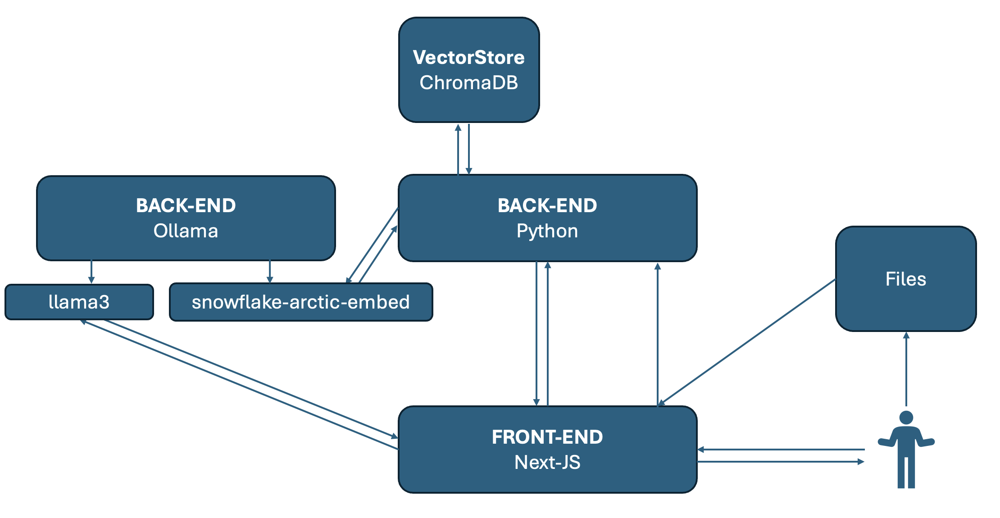
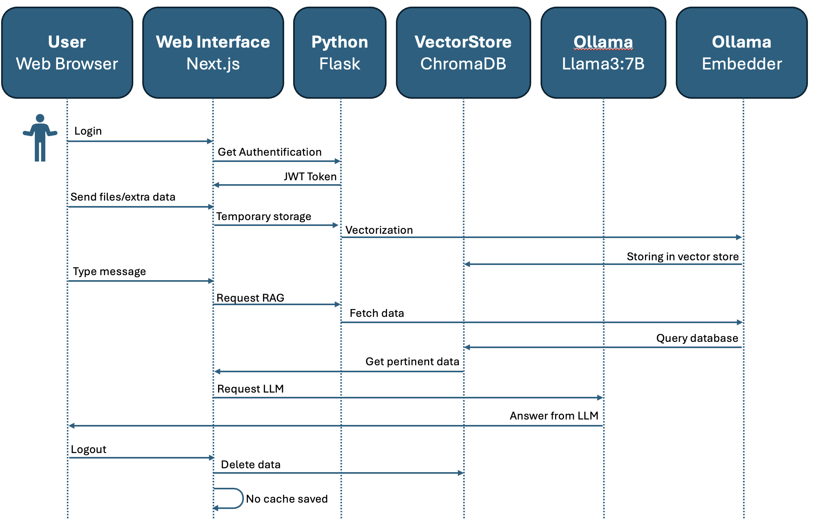

# Pa1Llama

Ce projet est un _proof of concept_ dans le cadre de la rédaction du rapport **"Grands modèles de langages locaux pour la Confidentialité des Données dans les Applications Personnelles et Professionnelles"**. Un rapport qui s'inscrit pour l'Application de la Démarche Scientifique (ADS) dans le cadre de mes études à CESI.
Le rapport sera joint _ici_ après sa finalisation.

L'objectif de ce projet est de développer une solution d'intelligence artificielle open-source, à la fois modulable, flexible, et transparente. Ce projet vise à démocratiser l'accès aux technologies d'IA modernes, en garantissant leur gratuité théorique mais surtout en assurant une confidentialité, une sécurité et une accessibilité optimales.

## Sondage

Afin de receuillir les avis en terme de performance de cette application, un sondage est disponible à l'adresse suivante : **https://docs.google.com/forms/d/e/1FAIpQLScWba9o3XuoVAnvXRApRKBN7I7vlDXx9cmROKVGilfSAjF68w/viewform?usp=sf_link**

_note : Ce projet ce base sur llama3 et snowflake-arctic-embed, le tout en local sans aucune requete à internet_
_Pour des performances optimal il est conseillé d'utiliser un ordinateur avec au moins 16go de ram (environ 8go de libre)_

## Prérequis

Avant de démarrer, assurez-vous d'avoir installé les logiciels suivants :

- Python 3.12 ou plus récent (_pour le mode developpment_)
- Node.js 18.x ou plus récent (_pour le mode developpment_)
- Ollama (*https://ollama.com/*) (_pour le mode developpment et production_)
- Docker (_pour le mode production_)

## Installation de l'application en mode **developpement**

### Installation des modèles d'IA

```bash
ollama pull llama3
ollama pull snowflake-arctic-embed
```

1. **Cloner le dépôt :**
   ```bash
   git clone https://github.com/Maxougit/POC_ADS.git
   ```
2. **Installer les dépendances pour le backend :**
   ```bash
   cd POC_ADS
   python3 -m venv venv
   source venv/bin/activate # ou venv\Scripts\activate
   pip install -r requirements.txt
   ```
3. **Installer les dépendances pour le frontend :**
   ```bash
   cd Pa1Llama/pa1llama
   npm install
   ```

### Ajuster les variables d'environnement

```bash
OLLAMA_HOST = 'http://localhost:11434'
MODE = 'dev'
```

### Démarrer l'application

1. **Démarrer le backend :**

   ```bash
   cd POC_ADS
   source venv/bin/activate # ou venv\Scripts\activate
   python app.py
   ```

2. **Démarrer le frontend :**
   ```bash
    cd Pa1Llama/pa1llama
    npm run dev
   ```
3. **Accéder à l'application :**
   ```bash
    http://localhost:3000
   ```

# ------------------------------

## Installation de l'application en mode **production**

### Installation des modèles d'IA

```bash
ollama pull llama3
ollama pull snowflake-arctic-embed
```

1. **Cloner le dépôt :**
   ```bash
   git clone https://github.com/Maxougit/POC_ADS.git
   ```
2. **Lancer le conteneur Docker :**
   ```bash
   cd POC_ADS
   docker-compose up --build
   ```
3. **Accéder à l'application :**
   ```bash
    http://localhost:3000
   ```

_Note : Ajuster les varibles d'environnement au besoin dans les fichiers **.env**_
_Le mot de passe par défaut est **admin**:**admin**_

# ------------------------------

## Architecture de l'application





# ------------------------------

## Auteurs

@Maxougit
https://cv.maxenceleroux.fr/
github@maxenceleroux.fr

## Sources

- https://ollama.com/
- https://www.trychroma.com/
- https://www.snowflake.com/
- https://ai.meta.com/blog/meta-llama-3/
